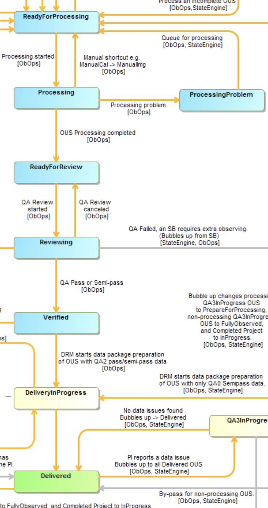
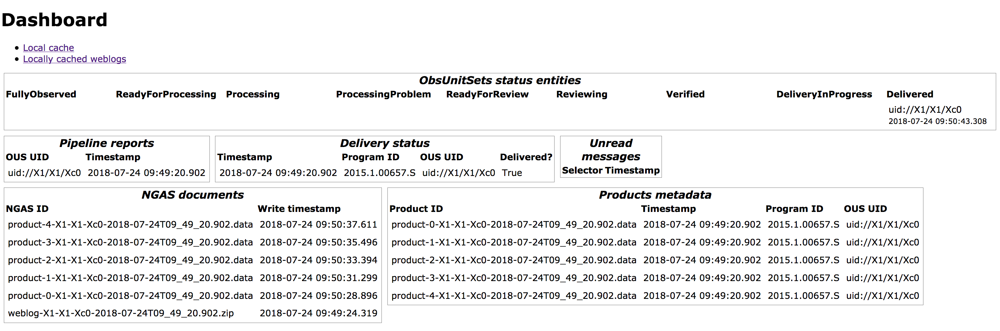

# Data Reduction Workflow System mockup

This is a mockup of the Data Reduction Workflow System (DRAWS) as shown [here](https://drive.google.com/file/d/1ZOBstezIVuuSk9BTgO9LrMb2INlfKTbj/view?usp=sharing)
and [here](https://drive.google.com/file/d/11dwEzQyKbKvUbyV__czR1KUtYUBSSo7k/view?usp=sharing), showing that it can be implemented as an asynchronous message-based system. It's based on a pipeline of components communicating via a messages-passing bus, including a module (simulating the XTSS) implementing an RPC-like executor.

This version implements stages _ReadyForProcessing_, _Processing_,
_ProcessingProblem_, _ReadyForReview_, _Reviewing_, _Verified_, _DeliveryInProgress_, _Delivered_ of the
[OUS life-cycle](https://ictwiki.alma.cl/twiki/bin/view/ObsIF/ObsUnitSetLifeCycleJpg):



## Prerequisites

* [Python 3.7.x](https://www.python.org/downloads/)
* A running instance of [CouchDB](couchdb.apache.org)
* The [Requests](http://docs.python-requests.org/en/master) Python package to communicate with the database

<!-- 
For this module, and in contrast to what is listed
[here](../README.md), you will not need the
[Pika package](https://pika.readthedocs.io/en/0.11.2/) or
[RabbitMQ 3.7.x](https://www.rabbitmq.com/)
-->

## Modules

### The message bus

See the sec. "Message bus" of the [DRAWS System Architecture Document](https://docs.google.com/document/d/1JQJUDraWk5ipAxgfIP5FoLXRGRnb_F4WeKDvXa2kwxU/edit?usp=sharing)

*Notice* To reduce the amount of polling the bus uses a simple algorithm that extends the sleep intervals progressively. That means, after a period of inactivity the message queue may take some time to react to new messages.


### CouchDB

Provides persistence to the system, supporting the message bus and mocking the State Archive, NGAS and various Oracle tables. Wrapped by the utilities in `shared/dbcon.py`, providing a vendor-agnostic API (?).
It's used in its default configuration.

You'll need to create some empty databases in CouchDB:
   * _msgq_, supporting the message bus
   * _ngas_, where NGAS is mocked; see also `shared/ngascon.py`
   * _pipeline-reports_, to store the Pipeline report files (mocks Oracle)
   * _status-entities_, where the OUSs are persisted (mocks Oracle)
   * _products-metadata_, metadata of the Pipeline-generated data products (mocks Oracle)
   * _delivery-status_, delivery status reports of the Product Ingestor (mocks Oracle)

**Note** All CouchDB operations can be performed from the Fauxton GUI (`http://localhost:5984/_utils/#`) or from the command line (see [the CouchDB API documentation](http://docs.couchdb.org/en/2.1.2/api/index.html)):
```
curl -X PUT http://localhost:5984/msgq
curl -X PUT http://localhost:5984/ngas
curl -X PUT http://localhost:5984/pipeline-reports
curl -X PUT http://localhost:5984/status-entities
curl -X PUT http://localhost:5984/products-metadata
curl -X PUT http://localhost:5984/delivery-status
```


### launcher.py

Infrastructure component, creates status entities.  
Usage:  
`launcher.py [-h] progID ousUID`

where _progID_ is the ID of the project containing the OUS, _ousUID_ is the ID of the OUS that should be processed.  
For instance:  
`./launcher.py 2015.1.00657.S uid://X1/X1/Xb2`

If needed, it creates (or resets) a status entity for the OUS in the _ReadyForProcessing_ state, with no substate (Pipeline recipe).

### aqua-batch-helper.py
Mock of AQUA Batch Helper. Usage:  
`./aqua-batch-helper.py`  

A **background thread** polls the database for instances of _ReadyForProcessing_ state with no substate. When one is found a Pipeline recipe is selected (in some random way) and assigned.

### dra.py
Mock of Data Reducer Assignment tool. Usage:  
`./dra.py`  
Depends on the value of the DRAWS_LOCATION environment variable, one of _EA_, _EU_, _JAO_ and _NA_.

This is an interactive application. A text-based user interface allows rudimentary assignment of an OUS to an executive/location for Pipeline processing. _ReadyForProcessing_ OUSs with no substate (PL recipe) are displayed: when one is selected it transitions to the _Processing_ state and it's assigned to the current location (by setting the PL_PROCESSING_EXECUTIVE flag).

Finally, a message is sent to Torque/Maui on the `pipeline.process.<loc>` selector, where &lt;loc&gt; is the current location, simulating the Torque/Maui interface.


### torque-maui.py

Mock of Torque/Maui resource management and scheduling tools. Usage:  
`./torque-maui.py [-x MAXEXECUTIONS]`  
where optional parameter _MAXEXECUTIONS_ indicates how many Pipeline executions may run in parallel; defaults to 1.

The script depends on the value of the DRAWS_LOCATION environment variable, one of _EA_, _EU_, _JAO_ and _NA_.

It listens for messages on `matching pipeline.process.<loc>` selector, where &lt;loc&gt; is the current location, and expects the message to include the Observing Program ID, OUS ID and the Pipeline processing recipe. For instance:
```
  {
    "progID":"2015.1.00657.S",
    "ousUID":"uid://X1/X1/Xb2",
    "recipe":"PipelineCalibration"
  }
```
Upon reception, `pipeline-driver.py` is launched as a subprocess.


### pipeline-driver.py

Mocks the replacement for DARED.  
Usage:  
`pipeline-driver.py [-h] [-mr maxruns] progID ousUID recipe`  
where _progID_ is the the ObsProgram ID (something like _2015.1.00657.S_), _ousUID_ is the OUS UID (for instance _uid://X1/X1/Xb2_) and _recipe_ is one of the Pipeline recipes, like _PipelineCalibration_.  
For instance:    
`./pipeline-driver.py 2015.1.00657.S uid://X1/X1/Xb2 PipelineCalibration`

The script depends on the value of environment variables DRAWS_LOCATION (one of _EA_, _EU_, _JAO_, _NA_) and DRAWS_REPLICATED_CACHE, the absolute pathname of the local replicated cache directory.

When a message arrives:
* Sets the OUS to _Processing_
* Starts the Pipeline by launching `pipeline.py` as a subprocess
  * If Pipeline processing failed, set the OUS state to _ProcessingProblem_
* Copies the products directory to the replicating cache directory and sends a message to the JAO cache replicator on the `cached.JAO` selector -- meaning "pull this product directory to yourself".
* Copies the Weblog to the replicating cache directory and sends a message to the JAO *and* the local replicators, on selectors `cached.JAO` and `cached.EU` respectively -- meaning "pull this Weblog file to yourself". (If the current executive is JAO only one message is sent.)
* Sends the XML text of the pipeline report to AQUA at JAO on the `pipeline.report.JAO` selector.
* Finally, it sets the state of the OUS to _ReadyForReview_.


### pipeline.py

Mocks the ALMA Pipeline.  
Usage:  
`pipeline.py [-h] progID ousUID exec`  
where where _progID_ is the ID of the project containing the OUS, _ousUID_ is the ID of the OUS that should be processed and _exec_ is the Executive where the pipeline is running. For instance:  
`./pipeline.py 2015.1.00657.S uid://X1/X1/Xb2 EU`

It simulates processing by waiting a random interval, and 1 in 10 times (randomly) terminates with a processing error. Otherwise it create a products directory including a Weblog, a Pipeline report and a number of data products. For instance:
```
2015.1.00657.S_2018_07_19T07_10_03.781/
└── SOUS
    └── GOUS
        └── uid___X1_X1_Xc1
            └── products
                ├── pl-report-X1-X1-Xa1-2018-07-19T07:10:03.781.xml
                ├── product-0-X1-X1-Xa1-2018-07-19T07:10:03.781.data
                ├── product-1-X1-X1-Xa1-2018-07-19T07:10:03.781.data
                ├── product-2-X1-X1-Xa1-2018-07-19T07:10:03.781.data
                ├── product-3-X1-X1-Xa1-2018-07-19T07:10:03.781.data
                ├── product-4-X1-X1-Xa1-2018-07-19T07:10:03.781.data
                └── weblog-X1-X1-Xa1-2018-07-19T07:10:03.781.zip
```
Note that we don't need to keep track of the actual UIDs of the Science Goal and Group OUS, we just use _SOUS_ and _GOUS_ instead.

### replicated-cache.py

Implements an `rsync` based replicator, used to copy files from the ARCs to JAO. For instance, Pipeline product directories and Weblogs produced at the ARCs are copied to a local (ARC) cache, then replicated to JAO.  
Usage:
```
replicated-cache.py [-eac EACACHE] [--euc EUCACHE] [--nac NACACHE] [-p PORT]
```
where PORT is the port number of the embedded Web server (default is 8000), EACACHE is the `rsync` location of the EA cache directory,  _username@host:dir_ (or simply _dir_);  EUCACHE for the EU cache dir and NACACHE for the NA cache directory. 

The script depends on the value of environment variables DRAWS_LOCATION (one of _EA_, _EU_, _JAO_, _NA_) and DRAWS_REPLICATED_CACHE, the absolute pathname of the local replicated cache directory. 

Note that parameters _eac_, _euc_ and _nac_ are only meaningful if DRAWS_LOCATION=JAO; that is, if we are mocking the JAO installation of the replicated cache, which needs to know about the Executives' installations.

For instance:  
`./replicated-cache.py -euc /tmp/EU`

It listens for message sent to _cached.&lt;EXEC&gt;_ and expects the body of the request to be a JSON document:  
```
  {
    "fileType":"weblog",
    "cachedAt":"EU",
    "name": "weblog-X1-X1-Xa1-2018-07-19T07:10:03.781.zip"
  }
```
where _fileType_ can be _weblog_, _productsdir_, ...

It will then replicate the file or directory from the _cachedAt_ executive to JAO using the _XXCACHE_ spec given on the command line.  
If the file type is Weblog, the zipped file is expanded and can be served to a browser by an embedded HTTP server, visiting for instance  `http://localhost:8000/weblogs/weblog-X1-X1-Xa1-2018-07-19T07:10:03.781`

### xtss.py

Mock-up of the XTSS, an interface to the State System, providing no state transition checks.  
It implements an RPC server... (**TODO**)  
Usage:  
`./xtss.py`

It listens on selector _xtss_ and expects the body of the request to be a JSON document:
`{ "operation":"...", "ousUID":"uid://A003/X1/X1a", "value":"..."}`
where _operation_ can be one of _set-state_, _set-exec_, _set-exec_ , ...; and the meaning of _value_ depends on the command. For instance:  
`{"operation":"set-state", "ousUID":"uid://X1/X1/Xb2", "value":"ReadyForProcessing"}`  

### aqua-qa2.py

Mock of AQUA QA2. Usage:  
`./aqua-qa2.py`  

A **background thread** listens on selector `pipeline.report.JAO` for requests to store a Pipeline report, and expects the message to be a JSON object including _ousUID_; _source_, the executive where the Pipeline was running; _report_, the report's XML text, BASE64-encoded; _timestamp_, the Pipeline run's timestamp; _productsDir_, the name of the products directory for that Pipeline run. For instance:
```
{
  "ousUID" : "uid://X1/X1/Xaf",
  "source" : "EU",
  "report" : "Cjw/eG1sIHZlcnNpb2..."
  "timestamp" : "2018-07-19T08:50:10.228",
  "productsDir": "2015.1.00657.S_2018_07_19T08_50_10.228"
}
```
When the message arrives a new entry is created in the `pipeline-reports` database.


In the **foreground**, a text-based user interface allows rudimentary QA2 review of a Pipeline execution. Once an OUS is selected its state is set to _Reviewing_ and the user can examine the Pipeline report and the Weblog. If the QA2 flag is set to _Fail_ the OUS state is reset to _ReadyForProcessing_.

Otherwise (QA2 flag _Pass_ or _Semipass_) OUS state is set to _Verified_ and a message is sent to the Product Ingestor on selector `ingest.JAO`.  Finally, the OUS state becomes _DeliveryInProgress_.

### product-ingestor.py

Mocks the Product Ingestor. Usage:  
`product-ingestor.py [-h] lcache`
where _lcache_ is the absolute pathname of the local replicating cache directory.

It listens on selector `ingest.JAO` and expects the body of the request to be a JSON document including _ousUID_; _timestamp_, timestamp of the Pipeline execution; _productsDir_, the name of the products directory for that Pipeline run. For instance:
```
{
  "ousUID" : "uid://X1/X1/Xc1",
  "timestamp" : "2018-07-23T13:32:25.355",
  "productsDir" : "2015.1.00657.S_2018_07_23T13_32_25.355"
}
```
The products directory should be a subdirectory of the local replicating cache directory.

Upon receiving the message, the script recovers all products from the JAO replicating cache and ingests them into NGAS. While doing that it adds metadata records and keeps the delivery status updated.  
When done with the data products, it updates the delivery status one more time.

In the course of its operation, it updates the OUS status substate from _IngestionTriggered_ to _AnalyzingProducts_, _IngestingProducts_ and _ProductsIngested_.

### data-tracker.py

Mocks the Data Tracker running at an ARC. Usage:  
`data-tracker.py`

It runs an endless loop looking for OUS status entities with state _DeliveryInProgress_ and substate _ProductsIngested_. when one is found, the script retrieves its delivery status record and extracts the list of ingested data products.

It then checks whether all those products can be found in the local (ARC) NGAS: if they are all present it sets the OUS state to _Delivered_. (No email notification is sent.)

### webapp/server.py

A simple Web app showing all (?) that's interesting to know about the system. It refreshes automatically every second.
Example:




<!--
### aqua-qa0.py

Usage:  
```
./aqua-qa0.py [-h] uid
```
where _uid_ is the ID of an OUS, something like `uid://A003/X1/X1a`.

Simulates a QA astronomer setting the QA0 score for an OUS to "pass", using AQUA; it also plays the role of PLChecker by setting a random Pipeline recipe.
New OUSs will be silently created.

The module
1. injects the OUS into the system by setting its state to _ReadyForProcessing_
2. sets its Pipeline recipe to a random one
3. broadcasts the Pipeline recipe change to queue _pipe_, selector _recipe.change.&lt;recipe>_

**Note**: in Cycle 5 (and probably 6) state changes are distributed across multiple components. The QAA sets the score for an ExecBlock (not an OUS), and AQUA and the State System eventually set the state of the containing Member OUS to _FullyObserved_. The Data Tracker then changes that to _ReadyForProcessing_ when all data has been replicated to the SCO.

### dr-assign.py

Simulates astronomers running DRAssign at the regions.
Usage:
```
./dr-assign.py
```
The module listens to queue _pipe_, selector _recipe.change.&lt;recipe>_ and expects the body of the request to be a string including a pair of words `ousUID recipe`; for instance:  
`uid://A003/X1/X3 PipelineCombination`. It then selects a random Executive. After this stage the OUSStatus entity is fully populated and looks like:
```
{
  "_id": "uid___A003_X1_X1b",
  "_rev": "3-2a18c0a05e4aabc77e07758a7685e2f5",
  "entityId": "uid://A003/X1/X1b",
  "state": "ReadyForProcessing",
  "pipeline-recipe": "PipelineSingleDish",
  "executive": "JAO"
}
```
(Field `_rev_` is maintained by CouchDB.)

Finally, it broadcasts a Pipeline processing request to queue _pipe_, selector _pipeline.process.&lt;executive>_

### pipeline-driver.py

It mocks up the replacement for DARED (and the APA) running at JAO or one of the executives. Usage:  
```
./pipeline-driver.py exec
```
where _exec_ is one of EA, EU, JAO or NA. The module listens to queue _pipe_, selector _pipeline.process.&lt;exec>_ and expects the body of the request to be the ousUID. It then:
1. sets the OUS state to _Processing_
2. "Launches" the Pipeline and waits for it to finish (up to 5 seconds)
3. Sets the OUS state to _ProcessingProblem_ or _ReadyForReview_ (with some probability)
-->

## Running the mockup

See the setup instructions for a [single host](single-host-setup.md) or [multiple hosts](multiple-host-setup.md).
