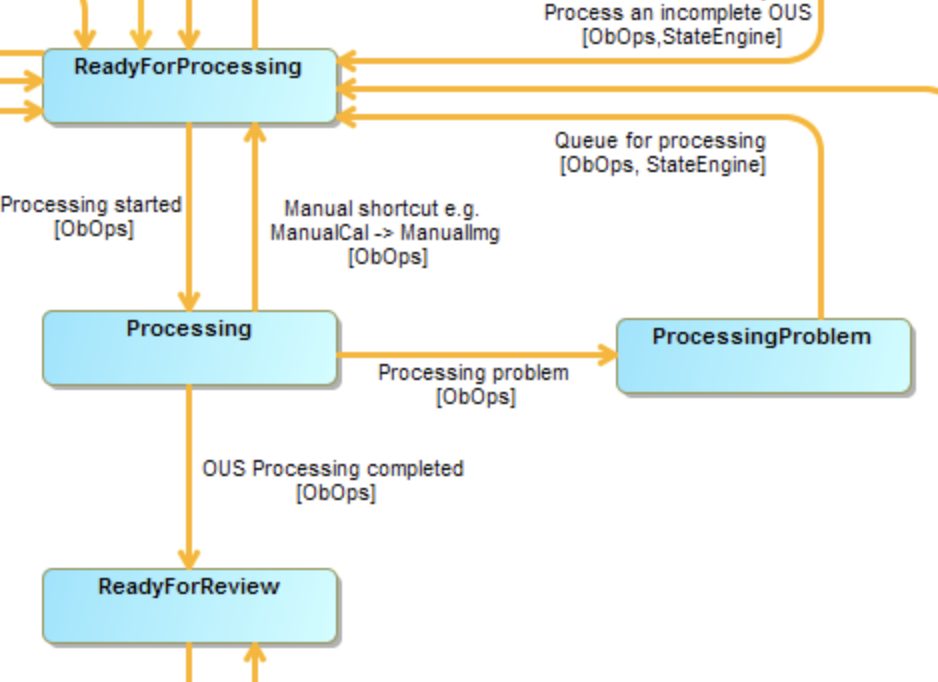

# Data Processing Workflow Sandbox -- System mockup

This is a mockup of the Data Processing Workflow system, demonstrating that it can be implemented as a asynchronous message-based system. It's based on the same concepts shown in the
[Pipes and filters](../pipes-and-filters/README.md)
and
[Message-passing RPC mode](../rpc/README.md)
sections: a pipeline of components communicating via a broadcasting messages plus a module (simulating the XTSS) implementing an RPC-like executor.

This version implements the _ReadyForProcessing_, _Processing_, _ProcessingProblem_ and _ReadyForReview_ stages of the
[OUS life-cycle](https://ictwiki.alma.cl/twiki/bin/view/ObsIF/ObsUnitSetLifeCycleJpg):



## Prerequisites

In addition to what is listed
[here](../README.md) you'll need
* A running instance of [CouchDB](couchdb.apache.org)
* The [Requests](http://docs.python-requests.org/en/master) Python package to communicate with the database

## Modules

### RabbitMQ

Implements the message passing system, providing both
broadcast and request-reply protocols. Used in its default, out-of-the-box configuration

### CouchDB

Provides entity state persistence, mocking the State Archive. Wrapped by the utilities in `shared/dbcon.py`, providing a vendor-agnostic API (?) to the XTSS mock-up (see below).
Also used in its default configuration. It stores (mocked!) OUSStatus entities in the `status-entities` table.

### xtss.py

Mock-up of the XTSS, an interface to the State System, providing no state transition checks.  
Depends on the State Archive mock-up provided by CouchDB and the utilities in `shared/dbcon.py`.  
Usage:
```
./xtss.py
```

It listens on queue _xtss_ and expects the body of the request to be a string including a triplet of words `cmd ousID value` where the meaning of _value_ depends on the command. For instance:  
`set-state uid://A003/X1/X1a ReadyForReview`  
or  
`set-recipe uid://A003/Xa71/X2c PipelineCalibration`  
Returns `201` (created) if all was well.

**Notes**
* State changes are broadcasted by default to queue _pipe_, selector _state.change.&lt;state>_
* OUSStatus entities will be created upon first reference

### aqua-qa0.py

Usage:  
```
./aqua-qa0.py [-h] uid
```
where _uid_ is the ID of an OUS, something like `uid://A003/X1/X1a`.

Simulates a QA astronomer setting the QA0 score for an OUS to "pass", using AQUA; it also plays the role of PLChecker by setting a random Pipeline recipe.
New OUSs will be silently created.

The module
1. injects the OUS into the system by setting its state to _ReadyForProcessing_
2. sets its Pipeline recipe to a random one
3. broadcasts the Pipeline recipe change to queue _pipe_, selector _recipe.change.&lt;recipe>_

**Note**: in Cycle 5 (and probably 6) state changes are distributed across multiple components. The QAA sets the score for an ExecBlock (not an OUS), and AQUA and the State System eventually set the state of the containing Member OUS to _FullyObserved_. The Data Tracker then changes that to _ReadyForProcessing_ when all data has been replicated to the SCO.

### dr-assign.py

Simulates astronomers running DRAssign at the regions.
Usage:
```
./dr-assign.py
```
The module listens to queue _pipe_, selector _recipe.change.&lt;recipe>_ and expects the body of the request to be a string including a pair of words `ousID recipe`; for instance:  
`uid://A003/X1/X3 PipelineCombination`. It then selects a random Executive. After this stage the OUSStatus entity is fully populated and looks like:
```
{
  "_id": "uid___A003_X1_X1b",
  "_rev": "3-2a18c0a05e4aabc77e07758a7685e2f5",
  "entityId": "uid://A003/X1/X1b",
  "state": "ReadyForProcessing",
  "pipeline-recipe": "PipelineSingleDish",
  "executive": "JAO"
}
```
(Field `_rev_` is maintained by CouchDB.)

Finally, it broadcasts a Pipeline processing request to queue _pipe_, selector _pipeline.process.&lt;executive>_

### pipeline-driver.py

It mocks up the replacement for DARED (and the APA) running at JAO or one of the executives. Usage:  
```
./pipeline-driver.py exec
```
where _exec_ is one of EA, EU, JAO or NA. The module listens to queue _pipe_, selector _pipeline.process.&lt;exec>_ and expects the body of the request to be the ousID. It then:
1. sets the OUS state to _Processing_
2. "Launches" the Pipeline and waits for it to finish (up to 5 seconds)
3. Sets the OUS state to _ProcessingProblem_ or _ReadyForReview_ (with some probability)
